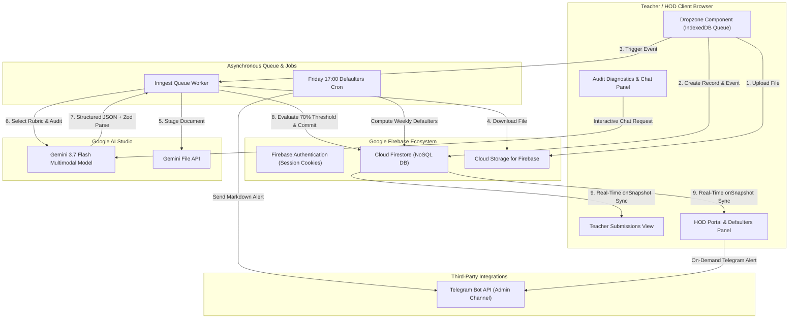

# HecTech LPAuditor: Enterprise Technical Architecture Blueprint

**System Version:** 2.1.0 (Production Hardened)  
**Primary Stack:** Next.js 16.2 (App Router, Turbopack), React 19, TypeScript, Google Firebase (Firestore, Storage, Auth), Google Gemini 3.7 Flash, Inngest.

---

## 1. High-Level System Architecture

The system utilizes an asynchronous, event-driven pipeline to offload pedagogical evaluations to a resilient background worker.

---

## 2. Asynchronous Audit Lifecycle & Pipeline Steps

The Inngest worker (`processLessonPlanAudit` in `lib/inngest/functions.ts`) executes an atomic 6-step pipeline:

1. **`update-status-processing`**: Updates the submission document in Firestore to `status: "PROCESSING"`.
2. **`retrieve-and-upload-to-gemini`**: Streams the document from Firebase Storage to local temporary storage and uploads it to the Google AI File API (`@google/generative-ai/server`), returning a URI and MIME type.
3. **`execute-audit`**:
   - Evaluates the subject using `getPedagogicalRubric(subject)`. If the subject matches one of the 10 configured departments, the Cambridge Framework prompt + Subject Yardstick are applied. If not, the `GENERAL_PEDAGOGICAL_RUBRIC` fallback is applied.
   - Invokes `gemini-3.7-flash` with `responseMimeType: "application/json"` and `responseSchema: auditResponseSchema`.
   - Parses the JSON string safely inside a `try/catch` block and validates the shape against `zodAuditResponseSchema`.
4. **`save-results` (Threshold Gate & Commitment)**:
   - Evaluates `const isBelowThreshold = auditResult.score < SCORE_PASSING_THRESHOLD` (70%).
   - If below 70%: sets `status: "RESUBMISSION_REQUIRED"`, `requires_resubmission: true`, `hod_decision: "REVISION_REQUESTED"`, and injects a critical compliance flag.
   - If 70% or above: sets `status: "COMPLETED"`, `requires_resubmission: false`, and `score_threshold_met: true`.
   - Writes structured findings into `ai_audits` collection and updates `submissions`.
5. **`cleanup-gemini-file`**: Deletes the file from the Google AI File API immediately after successful execution.
6. **`handle-failure`**: If unhandled errors occur during execution, updates `submissions` to `status: "FAILED"` with a sanitized error message for teacher inspection.

---

## 3. Database Schema (Cloud Firestore)

### `profiles` Collection
* **`id`** (`string` - matches Firebase Auth UID)
* **`full_name`** (`string`)
* **`email`** (`string` - institutional domain verified)
* **`role`** (`"TEACHER" | "HOD" | "ADMIN"`)
* **`department`** (`string` - e.g. "Primary Science", "Mathematics", "Administration")
* **`created_at`** (`timestamp`)

### `submissions` Collection
* **`id`** (`string` - auto-generated)
* **`teacher_id`** (`string`)
* **`subject`** (`string`)
* **`week_name`** (`string` - "Week 1" through "Week 14")
* **`grade_level`** (`string` - "Grade 1" through "Grade 6")
* **`file_url`** (`string`)
* **`file_path`** (`string`)
* **`status`** (`"PENDING" | "PROCESSING" | "COMPLETED" | "FAILED" | "RESUBMISSION_REQUIRED"`)
* **`requires_resubmission`** (`boolean`)
* **`score_threshold_met`** (`boolean`)
* **`parent_submission_id`** (`string | null` - links revisions)
* **`version`** (`number` - 1, 2, 3...)
* **`revision_notes`** (`string | null`)
* **`hod_decision`** (`"APPROVED" | "REVISION_REQUESTED" | "NEEDS_OBSERVATION" | null`)
* **`hod_feedback`** (`string | null`)
* **`hod_updated_at`** (`timestamp | null`)
* **`hod_updated_by`** (`string | null`)
* **`created_at`** (`timestamp`)

### `ai_audits` Collection
* **`id`** (`string` - auto-generated)
* **`submission_id`** (`string`)
* **`teacher_id`** (`string`)
* **`subject`** (`string`)
* **`rubric_type`** (`"CAMBRIDGE" | "GENERAL_PEDAGOGICAL"`)
* **`score`** (`number` - 0 to 100)
* **`lessons_detected`** (`number`)
* **`strengths`** (`string[]`)
* **`flags`** (`string[]`)
* **`cambridge_attributes`** (`object`: confident, responsible, reflective, innovative, engaged)
* **`command_verbs`** (`string[]`)
* **`cognitive_demand`** (`object`: low_recall, medium_application, high_evaluation)
* **`eal_scaffolding_score`** (`number | null`)
* **`time_compliance`** (`object`: is_compliant, total_allocated_minutes, pacing_feedback)
* **`age_appropriateness`** (`object`: score, feedback)
* **`instructional_delivery`** (`object`: teacher_student_ratio, methodology_notes, step_by_step_tips)
* **`raw_response`** (`map`)
* **`created_at`** (`timestamp`)

---

## 4. Security & Access Control (RBAC)

1. **Cloud Firestore Rules (`firestore.rules`)**:
   - Authentication restricted to `@stadelaideschool.com` accounts.
   - Teachers can only read and write their own submissions.
   - HODs can read and update decisions for submissions within their designated department.
   - Admins maintain full school-wide access.
   - `ai_audits` are client-read-only (written exclusively via Server Admin SDK).
2. **Cloud Storage Rules (`storage.rules`)**:
   - Restricts uploads strictly to `lesson-plans/{userId}/*` where the authenticated user matches `userId`.
3. **Next.js Edge Proxy (`proxy.ts`)**:
   - Verifies session cookie on all incoming page routes, redirecting unauthenticated users to `/auth/login`.
4. **Server Action Validation**:
   - All server actions authenticate the session via `getAuthenticatedUser()`, validate inputs with Zod schemas, and server-side enforce that an HOD cannot approve any plan scoring below 70%.

---

## 5. Defaulter Tracking & Telegram Alert Engine

* **Engine (`lib/defaulters.ts`)**: Dynamically queries active non-admin teacher profiles and compares against submissions for the selected academic week (`"Week 1"` through `"Week 14"`).
* **Telegram Integration (`lib/telegram.ts`)**: Formats a clean Markdown summary of submission rates and groups missing teachers by department, dispatching alerts via the Telegram Bot API.
* **Cron & On-Demand Execution**: Scheduled weekly on Fridays at 17:00 UTC via Inngest cron or triggered on-demand by HODs/Admins from the dashboard.
